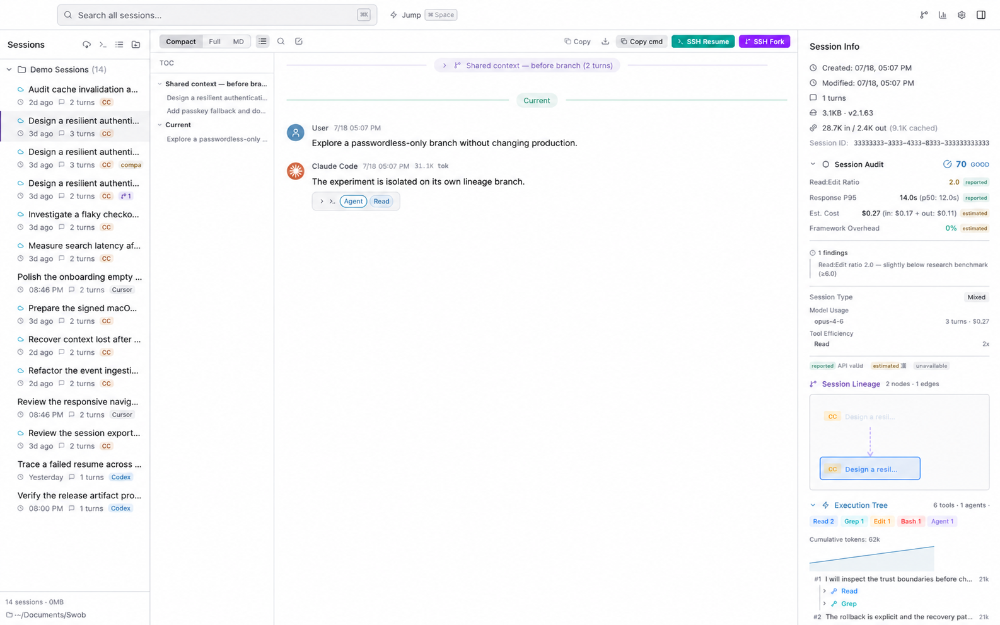
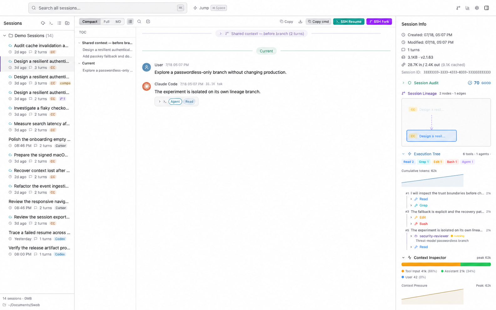
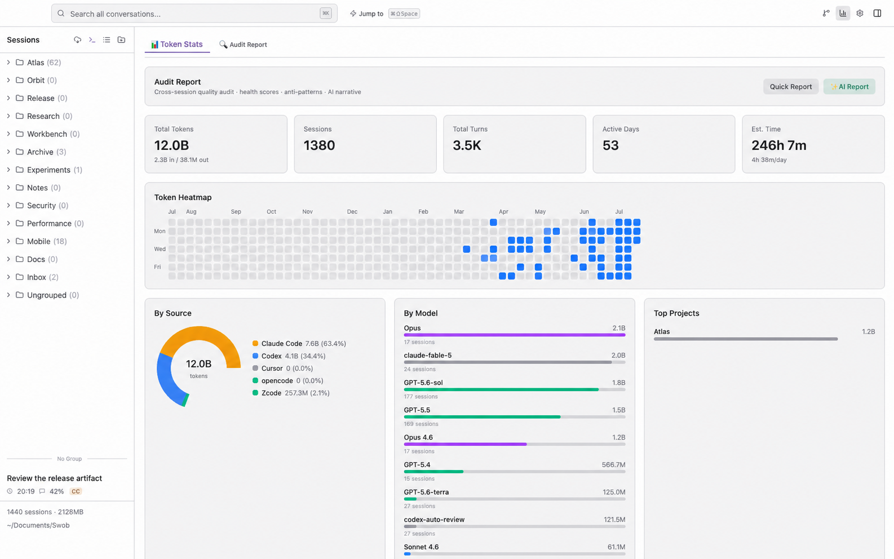

<div align="center">


# Swob

### AI 会話のための git graph

**失われたコンテキストを復元し、fork と compact を追跡し、Agent が実際に何をしたかをデバッグします。**

Swob は **6 個のネイティブ形式アダプター**と 1 個の Claude 互換形式でローカル履歴を解析します。ほかの 4 ソースは実験的なファイル検出のみで、メッセージ本文は読み取りません。ソースに証拠がある場合に限り、系譜、SQLite FTS5 増分検索、実行検査、provenance 付き監査、任意の AI Insights を提供します。

[Web サイト](https://swob.app/) · [Web サイトのソース](https://github.com/IvyYang1999/swob-website) · [検証済み Releases](https://github.com/IvyYang1999/swob/releases) · [更新履歴](CHANGELOG.md)

[English](README.md) · [中文](README.zh.md) · [日本語](README.ja.md)


</div>

> [!IMPORTANT]
> **公開 v1.3.1 は、ここで示す製品機能と一致しています。** 以下の機能画像はリリース済み source の画面を基に、英語デモとして再構成し、サンプルデータを匿名化したものです。実装済みのレイアウトとワークフローを示すもので、未編集の本番データ画面ではありません。画像内の数値は例示用で、下記の監査 corpus とは別集計です。


<p align="center"><sub>現在の <code>main</code> · 英語デモ再構成 · 匿名化した例示データ</sub></p>

## Swob が必要な理由

AI コーディングセッションは独立したチャットファイルではありません。resume は別ファイルを作り、fork は作業を分岐させ、compact は以前の文脈を要約に置き換えます。各 Agent は同じ種類の作業を別々の形式と場所に保存します。通常の Viewer は転記を開けても、その由来や Agent が文脈を失った理由までは説明できません。

Swob はセッション履歴を証拠として扱います。

- **系譜を追跡** — 対話型の力指向 Session Galaxy で、検証済みの fork / continuation 関係をたどります。
- **コンテキストを復元** — Claude Code の compact 前の内容を展開し、元ファイル消失後もローカルバックアップを保持します。
- **実行をデバッグ** — tool / sub-agent 呼び出し、コンテキスト圧力、compact 境界、遅延、framework overhead、エラー、反パターンを調べます。
- **解析済み履歴を検索** — SQLite FTS5 は正規化されたメッセージを増分索引化します。検出専用ソースは本文索引の対象外で、ソース別の検索制限も明示します。
- **安全に再開** — 対応 CLI へ正しい session ID と作業ディレクトリで戻り、source-aware な検証を行います。

## 見栄えの数字ではなく、検証可能な根拠

| 監査結果 | 意味 |
|---|---|
| **253 / 1,621** | ある実運用 Library の監査で、Claude Code の 253 セッションが既定の 30 日保持ポリシーにより元の保存先から消失していましたが、Swob のローカルバックアップには残っていました。 |
| **93.58%** | 同じ 1,621 セッション・5 ソースの監査 corpus で確認できた再開可能率です。全環境への成功保証ではありません。 |
| **1,704 sessions** | 新しい索引とダッシュボードの検証に使う現在のローカル性能/UI corpus です。 |
| **6+1+4 ソース** | 現在の `main` は 6 種の harness をネイティブに読み取り、1 種の互換フォーマットに対応し、4 種を実験的にファイル検出します（ファイル発見のみ、コンテンツ読み取りは未実装）。 |

## Session Galaxy

現在のグラフは実装済みの Canvas ベース力指向ビューです。検証済み系譜エッジと、弱い project/source/time グループを区別し、pan、zoom、inspect、open ができます。以前の PixiJS プロトタイプは追加検証のため意図的に戻されました。Swob は**現時点で WebGL レンダリングをうたっていません**。

## Session Debugger

Swob は transcript 表示だけではありません。

- **Execution Tree** — turn、tool call、sub-agent、エラー、所要時間、累積 token を再構築します。
- **Context Inspector** — user、assistant、tool input/output、system injection、thinking、image、compact に分類し、compact 境界と圧力警告を示します。
- **Session Audit** — 調査/編集比、thinking 根拠、遅延、推定コスト、framework overhead、セッション種別、モデル、tool 効率、中断、目標長、反パターン、frustration signal の 12 次元を監査します。
- **Provenance 表示** — 各指標を `reported`、`estimated`、`unavailable` として明示し、欠けた証拠を事実のように扱いません。

| Session Audit | Execution Tree + Context Inspector |
|---|---|
|  |  |

## 全セッション Insights

ローカルダッシュボードには token / cost 集計、365 日ヒートマップ、source / model / project 分布、時間帯と turn 分布、tool 利用、コード変更数、監査レポートがあります。

**AI Insights は任意で、設定するまで無効です。** 明示的に実行したときだけ、集計指標と上限付きの実ユーザーメッセージサンプルを、ユーザーが設定したプロバイダーへ送信します。有効化前に [PRIVACY.md](PRIVACY.md) を確認してください。



## 現在の `main` が読むソース

### ネイティブ形式アダプター（6）— 本文解析は可能、その他の能力はソース別

| ソースファミリー | ステータス | 備考 |
|---|---|---|
| Claude Code | Native | 本文、検索、usage、live watch、系譜、terminal resume は利用可能。Desktop import は実験的です。 |
| Codex | Native | 本文、検索、usage、live watch、系譜、terminal/native resume は利用可能です。 |
| Cursor | Native | 本文、live watch、terminal resume は利用可能。検索は実験的で、usage・系譜・native deep link は利用不可です。 |
| OpenCode | Native | 本文、usage、archive、terminal resume は利用可能。検索は実験的で、live watch・系譜・native deep link は利用不可です。 |
| ZCode | Native | 本文、usage、archive は利用可能。検索と workspace を開く deep link は実験的で、live watch と terminal resume は利用不可です。 |
| Pi | Native | 本文、tool、thinking、usage、relationship、検索、archive は利用可能。live watch は利用不可で、terminal resume は実験的です。 |

### 互換フォーマット（1）

| ソースファミリー | ステータス | 備考 |
|---|---|---|
| CC-Mirror | Compatible | Claude 互換の本文、検索、usage は利用可能。live watch と archive は利用不可で、terminal resume は実験的です。 |

### 実験的検出（4）— ファイル発見のみ、コンテンツ読み取りは未実装

| ソースファミリー | ステータス | 備考 |
|---|---|---|
| Antigravity | Experimental | ローカル transcript ファイルを発見可能。 |
| Grok / Factory | Experimental | JSONL 履歴ファイルを発見可能。 |
| Kimi Code | Experimental | ローカル `wire.jsonl` ファイルを発見可能。 |
| Hermes | Experimental | ローカル JSON session ファイルを発見可能。 |

> **正確性に関する注記：**「ネイティブ形式アダプター」は本文解析の実装を意味するだけで、全能力の提供を意味しません。検索、usage、系譜、live watch、archive、resume はソース別です。「実験的検出」はファイルとメタデータ用 placeholder の発見のみで、本文の読み取り・索引化はできません。正準マトリクスは [`src/shared/provider-capabilities.ts`](src/shared/provider-capabilities.ts) です。

## 類似プロジェクトとの機能比較

2026-07-21 時点の各公式 README に基づきます。`✅` = 明記、`◐` = 隣接または部分機能、`—` = 現行機能として記載なし。品質順位ではなく機能地図です。

| 機能 | Swob 現在の `main` | [Claude Code History Viewer](https://github.com/jhlee0409/claude-code-history-viewer) | [Agent Sessions](https://github.com/jazzyalex/agent-sessions) | [SessionView](https://github.com/tyql688/sessionview) |
|---|---|---|---|---|
| ローカル multi-harness 履歴 | ✅ 6 ネイティブ + 1 互換 + 4 実験的検出 | ✅ 9 providers | ✅ 9+ agents | ✅ 9 tools |
| 可視化 session lineage graph | ✅ 検証エッジ + grouping edge | ◐ Session Board、lineage ではない | — | ◐ child session 正規化、lineage graph の記載なし |
| Compact 履歴復元 | ✅ Claude Code | — | — | — |
| Execution tree / Agent call 分析 | ✅ | ◐ tool rendering | ◐ tool/output navigation | ◐ tool-call mix と child session |
| Context pressure inspector | ✅ turn 別カテゴリ + compact 境界 | ◐ token analytics | ◐ quota / session runway | ✅ session context/cache analytics |
| Provenance 付き health audit | ✅ | — | ◐ 検証不能な quota 状態を明示 | — |
| ローカル全文検索 | ✅ 解析済みソースを SQLite FTS5 に索引化。状態はソース別 | ✅ | ✅ local index | ✅ SQLite FTS5 |
| 元 CLI で resume | ✅ 対応ソース | ◐ session を開く/フォーカス | ✅ 対応 CLI | ✅ 対応ソース |
| Headless / browser mode | — | ✅ | — | ✅ |

## インストール

### 公開インストーラー

[GitHub Releases](https://github.com/IvyYang1999/swob/releases) を、現在のバージョン、対応 architecture、署名状態、不変 asset 名の正準情報源とします。この README は installer URL を推測せず、恒久的な fallback version も置きません。

> 2026-07-24 時点の公開 baseline は、Developer ID 署名・公証済みの v1.3.1 で、Apple Silicon / Intel Mac 向け asset があります。

**動作環境：** Apple Silicon または Intel の macOS。

> [!IMPORTANT]
> **v1.2.0 ユーザーは一度だけ手動移行が必要です。** v1.2.0 は Developer ID trust root より前のため、署名済み release line へ安全に自動更新できません。本リポジトリから対応する v1.3.1 DMG をダウンロードして Swob を一度上書きしてください。既存の v1.3.0 は、隔離され E2E gate 済みの署名 update channel を利用できます。

### 現在の `main`

```bash
git clone https://github.com/IvyYang1999/swob.git
cd swob
npm ci
npm run dev
```

ローカル DMG を作る場合：

```bash
npm run build:mac
```

## CLI

```bash
swob search "auth regression"    # ローカル横断検索
swob list --source codex         # source フィルター
swob resume <session-id>         # source-aware resume command
swob insights                    # ローカル利用集計
swob active                      # 実行中 session
swob install                     # CLI + Agent Skill
```

CLI は JSON を返すため、他の Agent は UI をスクレイピングせず Swob を利用できます。

## プライバシーとセキュリティ

- 基本の閲覧、索引、系譜、監査、Quick Report はローカルで計算します。
- 確認済みの現在のソースには、製品 analytics や session upload telemetry はありません。
- 起動時の更新確認はリリースサービスへ接続しますが、session 内容は送信しません。
- 任意の AI Insights は、明示確認後に限られた実 session サンプルを送ります。
- 現在の `main` では API credential をローカル Swob Library 設定に保存し、**Swob 自身では暗号化していません**。
- SSH resume と terminal resume は、ユーザーが明示的に設定・実行した宛先だけに接続します。

完全な境界は [PRIVACY.md](PRIVACY.md) を参照してください。脆弱性は [SECURITY.md](SECURITY.md) に従って非公開で報告し、公開 issue に transcript や credential を貼らないでください。

## Stable と Next

| チャンネル | 内容 |
|---|---|
| **Stable v1.3.1** | Developer ID 署名・公証済み macOS 正式版。信頼できる detail fallback、logical conversation history、確実な group folding、avatar/provider icon override、自動 CLI install と v1.3.0 の全機能を含みます。 |
| **現在の `main`** | v1.3.1 以降の開発 source。安定版 installer に未収録の変更を含む場合があり、ダウンロードの正準情報源は引き続き GitHub Releases です。 |

## 技術スタック

Electron 40 · React 19 · TypeScript · Zustand · Tailwind CSS 4 · SQLite FTS5 · Recharts · electron-vite

## コントリビュート

Issue と PR を歓迎します。すべての contribution commit に DCO の `Signed-off-by` trailer が必要です。詳細は [CONTRIBUTING.md](CONTRIBUTING.md) を参照してください。fixture やスクリーンショットを共有する前に、transcript 本文、絶対パス、credential、cookie、端末識別子を削除してください。セキュリティ報告は [SECURITY.md](SECURITY.md) に従ってください。

## ライセンス

**v1.3.0** 以降の Swob は [Apache License 2.0](LICENSE) で提供されます。**v1.2.0 以前は引き続き AGPL-3.0-only** であり、この変更は過去のリリースに遡及しません。著作権・商標表示は [NOTICE](NOTICE) を参照してください。
