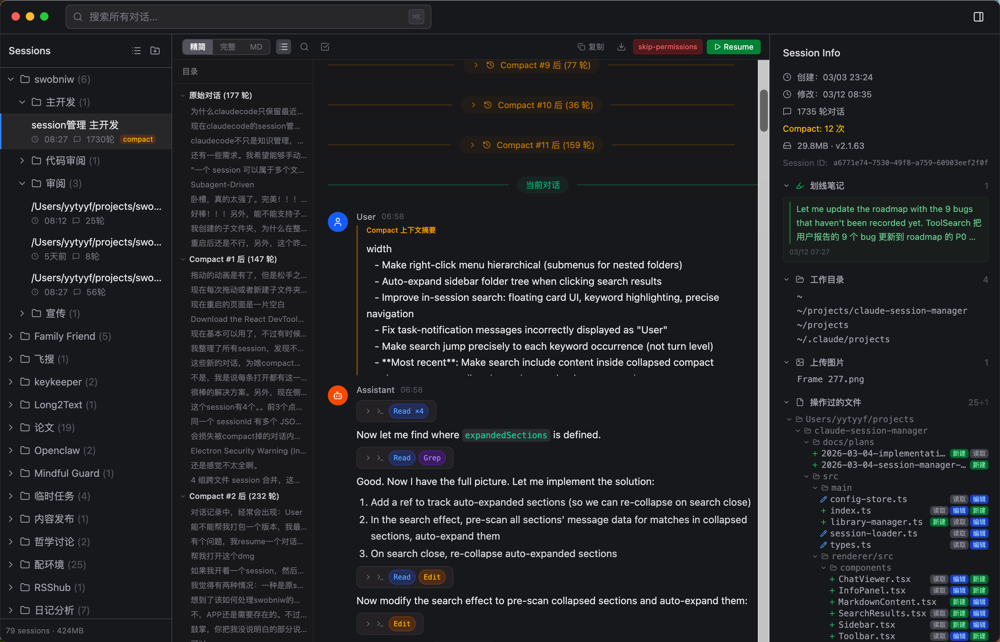

<p align="center">
  
</p>

<p align="center">
  <strong>AI forgets (compact). You don't.</strong><br>
  A native macOS desktop app to browse, search, and manage your Claude Code conversation history.<br>
  View pre-compact messages, highlight key insights, and resume any session — all from a visual GUI.<br>
  If you vibe-code from <code>~</code> and have 100+ sessions piled up with no organization — Swob is for you.
</p>



## Why Swob

Claude Code stores conversations as JSONL files in `~/.claude/projects/`, but there's no built-in way to browse, search, or organize them visually. The `/resume` command only shows recent sessions, and compact discards your conversation context. Swob solves this:

- **Pre-compact recovery** — Compact summaries collapse the full conversation, but Swob preserves and displays the original messages. Expand any compact section to see what was lost.
- **Highlight & annotate** — Select any text in a conversation to bookmark it. All highlights are collected in the sidebar — your personal knowledge trail across sessions.
- **One-click resume** — Click any session to reopen it in Terminal (`claude --resume`). Batch resume an entire folder at once. Working directory and permission mode are preserved automatically.
- **Drag as context** — Every session is auto-exported as a Markdown file. Drag it directly into another Claude Code conversation as context — carry knowledge across sessions.

## Features

<details>
<summary><strong>Browse & Organize</strong></summary>

- Tree view with nested folders, drag-and-drop, and custom titles
- Three view modes: Compact (hide tool noise), Full (everything), and Markdown (clean export)
- Branch detection: auto-merges continuation sessions, separates concurrent branches
- Sidechain (rejected plan) marking with dimmed display
- Right sidebar: session metadata, file operations tree, tool usage stats, skill invocations

</details>

<details>
<summary><strong>Search</strong></summary>

- Global full-text search across all sessions (⌘K)
- In-session keyword search (⌘F) with precise highlighting and match-by-match navigation
- Auto-reveals matches inside collapsed compact sections
- Regex support

</details>

<details>
<summary><strong>Highlight & Annotate</strong></summary>

- Select any text and click "Highlight" to bookmark it
- Highlights listed in right sidebar — click to jump back
- TOC entries with highlights get a green dot marker
- Powered by CSS Custom Highlight API — zero DOM mutation, fully React-compatible

</details>

<details>
<summary><strong>Resume Sessions</strong></summary>

- One-click resume in Terminal or iTerm2
- Batch resume: reopen all sessions in a folder
- Respects `--dangerously-skip-permissions` mode
- Auto-cd to the correct working directory

</details>

<details>
<summary><strong>Library</strong></summary>

- Auto-syncs from `~/.claude/projects/` via file watcher
- Each session is backed up to `~/Documents/Swob/` with readable Markdown transcript
- Native file drag-and-drop (drag a session to Finder, Notes, etc.)

</details>

## Install

### macOS (Apple Silicon / Intel)

Download the latest `.dmg` from [Releases](https://github.com/IvyYang1999/swob/releases).

### Build from Source

```bash
git clone https://github.com/IvyYang1999/swob.git
cd swob
npm install
npm run dev          # development with hot reload
npm run build:mac    # produces .dmg in dist/
```

## Requirements

- macOS (Apple Silicon or Intel)
- [Claude Code](https://docs.anthropic.com/en/docs/claude-code) installed (Swob reads session files from `~/.claude/projects/`)

## How It Works

Swob reads the JSONL conversation logs that Claude Code stores on disk. It parses session files, detects multi-file continuations and branches, reconstructs pre-compact history, and presents everything in a visual interface. Your data stays local — Swob never uploads anything.

## Tech Stack

Electron + React 19 + TypeScript + Zustand + Tailwind CSS 4, built with electron-vite.

## Related

- [claude --resume](https://docs.anthropic.com/en/docs/claude-code) — Built-in session resume (limited to recent sessions)
- [awesome-claude-code](https://github.com/hesreallyhim/awesome-claude-code) — Curated list of Claude Code tools

## License

[AGPL-3.0](LICENSE)
