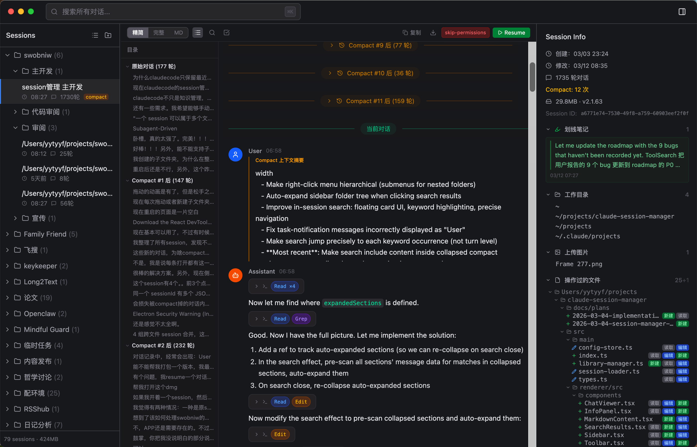

<div align="center">


<p>
  <a href="README.md">English</a> | <a href="README.zh.md">中文</a> | <a href="README.ja.md">日本語</a> | <a href="CHANGELOG.md">更新日志</a>
</p>

<p>
  
  
  
  
  
</p>

<h3>AI 会话的 git graph</h3>

<p>
  <strong>Claude Code</strong>、<strong>Codex</strong>、<strong>Cursor</strong>、<strong>OpenCode</strong>、<strong>Zcode</strong> 的免费开源会话管理器。<br/>
  看清 session 之间怎么分叉、怎么续写。展开被 compact 折叠的历史。全局搜索。一键续写。<br/>
  100% 本地——你的对话不离开你的机器。
</p>

<p>
  <a href="https://ivyyang1999.github.io/swob/"><strong>产品主页</strong></a> · <a href="https://github.com/IvyYang1999/swob/releases"><strong>下载</strong></a>
</p>

</div>

<br/>

<p align="center">
  
</p>

---

> **253 / 1,621** — 来自一个真实用户的会话历史：253 个会话（15.6%）已被 Claude Code 默认的 30 天清理策略（`cleanupPeriodDays`）删除。它们只因 Swob 做了备份才得以保留。官方工具正在删除你的对话——你可能完全不知道。

---

## 问题

你用 Claude Code 从 `~` 目录 vibe-code 好几个月了。200 多个 session 堆在一起毫无组织。session 还会繁殖：resume 一下多出一个新文件，fork 一个实验分支，compact 之后又接着聊——很快五个文件都是「同一场对话」，却没有任何工具告诉你它们之间什么关系。一半历史被 compact 摘要折叠。内置的 `/resume` 只显示最近的 session。想找到那个你解决了棘手 bug 的对话？祝你好运。

## 方案

Swob 读取 Claude Code、Codex、Cursor、OpenCode、Zcode 存在磁盘上的会话文件。解析每一个 session，**识别它们之间的关系——fork、resume、续写**，原地展开被 compact 折叠的历史，并以可搜索、可整理的界面呈现。

数据 100% 留在本地。Swob 不上传任何东西。基于 AGPL-3.0 免费开源。

---

## 核心功能

### 会话血统——看清哪个 session 从哪来

AI session 不会安分地待在一个文件里：resume 会生出新文件，fork 会分裂对话，compact 会把摘要接到一个新开头上。Swob 精确识别这些关系——fork 边、续写边、跨文件 resume——并维护一份落盘的血统注册表，让会话家谱在缓存重建后依然存活。相当于 `git log --graph`，只不过对象是你的会话。（可视化血统树已在路线图上。）

### 展开被 Compact 的对话

Claude Code 会压缩对话来节省上下文——模型忘了，但原始消息仍然在 JSONL 文件里。Swob 把每个 compact 块内联展示，一键原地展开被折叠的内容，不用去翻原始 JSONL。

### Spotlight 会话跳转 — `⌘⇧K`

全局快捷键唤出类 Spotlight 搜索窗口。支持内容、项目名、文件夹、时间（`今天`、`昨天`、`本周`）模糊搜索，按来源（`claude`、`codex`、`cursor`、`opencode`、`zcode`）过滤。不到一秒跳转到任意 session，无需切换窗口。

### 全文搜索 — `⌘K`

跨所有 session 一次搜索。匹配内容自动展开 compact 折叠区块，即使内容被 compact 了也能找到。局部搜索（`⌘F`）支持正则。

### 五工具合一：Claude Code + Codex + Cursor + OpenCode + Zcode

读取 `~/.claude/projects/`、`~/.codex/sessions/`、`~/.cursor/projects/`、`~/.local/share/opencode/opencode.db` 和 `~/.zcode/cli/db/db.sqlite`——在一个界面浏览和恢复五个工具的所有 session。

### Token 洞察仪表盘

- 5 个统计卡片：总 token、session 数、对话轮次、活跃天数、预估时间
- 365 天贡献热力图（像 GitHub，但是看你的 AI 使用量）
- 来源环形图（Claude Code / Codex / Cursor / OpenCode / Zcode）
- 模型使用分布
- 项目 token 消耗排行
- 30 天日趋势图

### 一键续写

点击任意 session 即可在 Terminal 或 iTerm2 中恢复。支持批量续写整个文件夹。自动保留工作目录和 `--dangerously-skip-permissions` 模式。也支持 Codex（`codex resume`）和 Cursor（`cursor agent --resume`）。

### SSH 远程续写

配置 SSH 连接，直接从应用中续写远程服务器上的 session。

### CLI — `swob`

```bash
swob search "认证 bug"           # 模糊搜索 session
swob list --source codex        # 按来源过滤
swob resume <id>                # 获取续写命令
swob insights                   # token 使用统计
swob active                     # 显示运行中的 session
swob install                    # 安装 CLI + Agent Skill
```

所有命令输出 JSON。`swob install` 还会安装一个 Claude Code Skill，让 Claude 在对话中可以调用 `swob` 作为工具。

### 会话整理

树形侧边栏，嵌套文件夹、拖拽排序、自定义标题。三种视图：精简（隐藏工具噪音）、完整（全部展示）、Markdown（干净导出）。

### 高亮与笔记

选中任意文本标注为书签。所有高亮汇总在右侧边栏，支持点击跳回——跨 session 的个人知识足迹。

### 元数据侧边栏

每个 session 展示：创建/更新时间、对话轮次、token 用量（input/output/cache）、工具调用统计、skill 调用记录、文件操作树、引用文件列表、预估活跃时间。

### iCloud 备份

Session 自动备份到 `~/Documents/Swob/`，生成可读的 Markdown 转录。iCloud 占位符文件自动检测并按需下载。

### 活跃会话检测

绿点标记正在运行的 session。通过 `ps` 轮询（1s 间隔）和文件变化监听器检测。

### 拖拽导出

每个 session 自动导出为 Markdown。拖到其他应用（Finder、备忘录、另一个 Claude Code 对话）即可跨会话传递上下文。

### 双语界面

完整支持中文（zh-CN）和英文。

---

## 安装

从 [**Releases**](https://github.com/IvyYang1999/swob/releases) 下载最新的 `.dmg`。

> **未签名版本说明：** Swob 尚未做 Apple 公证。如果 macOS 提示应用「已损坏或无法打开」，运行：
> ```bash
> xattr -cr /Applications/Swob.app
> ```
> 从 v1.2.0 起，Swob 会在应用内提示并直接安装更新，不用再回来手动下载。

或从源码构建：

```bash
git clone https://github.com/IvyYang1999/swob.git
cd swob
npm install
npm run dev          # 开发模式（热重载）
npm run build:mac    # 在 dist/ 生成 .dmg
```

**系统要求：** macOS（Apple Silicon 或 Intel）· 已安装 Claude Code

---

## 技术栈

Electron 40 · React 19 · TypeScript · Zustand · Tailwind CSS 4 · Recharts · electron-vite

---

## 相关项目

- [claude --resume](https://docs.anthropic.com/en/docs/claude-code) — 内置 session 恢复（仅限最近的 session）
- [CC Switch](https://github.com/farion1231/cc-switch) — AI CLI 工具的供应商和配置管理器
- [awesome-claude-code](https://github.com/hesreallyhim/awesome-claude-code) — Claude Code 工具合集

---

## 许可证

[AGPL-3.0](LICENSE)
