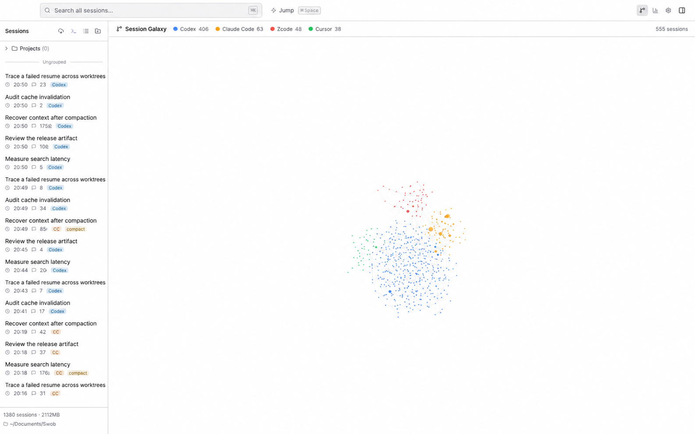
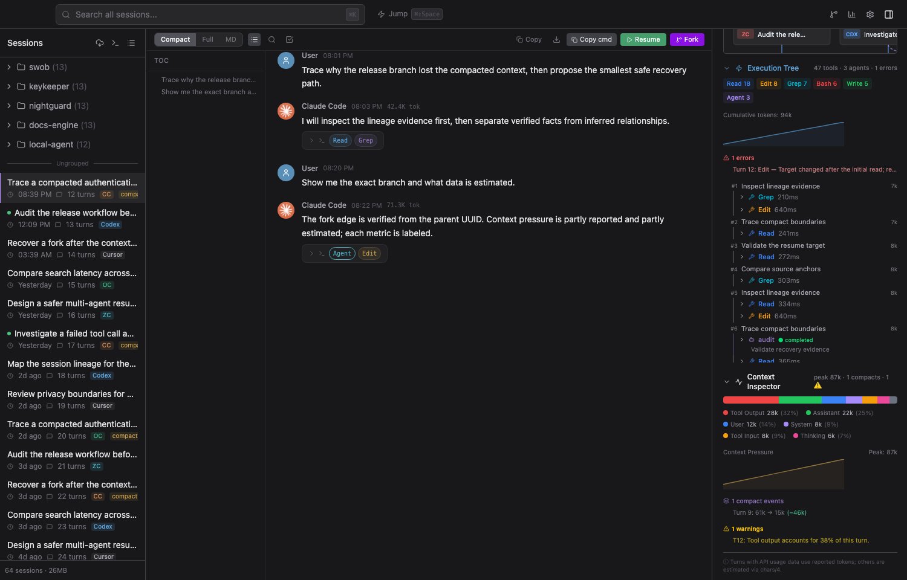

<div align="center">


# Swob

### AI 对话的 git graph

**找回丢失的上下文，追踪 fork 与 compact，调试 Agent 到底做了什么。**

Swob 通过 **5 个原生格式适配器**与 1 个 Claude 兼容格式解析本地历史；另有 5 个实验来源只能发现文件，尚不能读取消息正文。来源确有证据时，Swob 才提供血统、SQLite FTS5 增量检索、执行检查、带来源标记的审计和可选 AI Insights。

[官网](https://ivyyang1999.github.io/swob/) · [已验证的 Releases](https://github.com/IvyYang1999/swob/releases) · [更新日志](CHANGELOG.md)

[English](README.md) · [中文](README.zh.md) · [日本語](README.ja.md)


</div>

> [!IMPORTANT]
> **产品通道有意分开。** 下方功能图以当前 `main` 的界面为依据，英文化重构并使用了隐私脱敏的演示数据；它们展示的是已实现的布局与流程，不是未经编辑的生产数据截图。图内数字仅用于演示，与下方审计语料分开统计。公开的 **v1.2.0 稳定版 DMG 早于 Session Galaxy、多 harness 导入、Session Debugger、AI Insights 和 SQLite FTS5**。可从源码构建 `main` 体验；这里不承诺未发布能力会进入某个指定安装包。



<p align="center"><sub>当前 <code>main</code> · 英文演示重构 · 使用隐私脱敏的示例数据</sub></p>

## 为什么需要 Swob

AI 编程会话不是一堆互不相干的聊天文件。resume 会生成新文件，fork 会把任务分叉，compact 会用摘要替换早期上下文；不同 Agent 又把同一种工作存进互不兼容的位置。普通 Viewer 能打开一份转录，却解释不了它从哪里来，也解释不了 Agent 为什么逐渐跑偏。

Swob 把会话历史当作证据：

- **追踪血统**——在交互式力导向 Session Galaxy 中浏览经过验证的 fork 与 continuation 关系。
- **恢复上下文**——展开 Claude Code compact 前的内容，并在源文件消失后保留本地备份。
- **调试执行过程**——检查工具/子 Agent 调用、上下文压力、compact 边界、延迟、框架开销、错误与反模式。
- **检索已解析历史**——SQLite FTS5 增量索引规范化消息；纯检测来源不进入正文索引，各来源的检索缺口保持可见。
- **可靠续写**——在来源支持时，携带正确的 session ID 和工作目录返回对应 CLI，并进行来源感知校验。

## 证据，不是虚荣指标

| 审计结果 | 含义 |
|---|---|
| **253 / 1,621** | 一份真实审计 Library 中，253 个 Claude Code 源会话已在默认 30 天保留策略下消失；Swob 仍保有本地备份。 |
| **93.58%** | 同一份 1,621 会话、五来源语料的可验证续写率。这是已观察到的语料结果，不是对所有环境的成功率承诺。 |
| **1,704 sessions** | 当前本地性能和界面验证语料，用来压测新索引与 Insights。 |
| **5+1+5 来源** | 当前 `main` 原生读取 5 种 harness，支持 1 种兼容格式，另有 5 种实验性文件检测（仅发现文件，尚不读取正文）。 |

## Session Galaxy

当前图谱是真实的 Canvas 力导向视图，可区分经过验证的血统边与较弱的项目/来源/时间分组关系，并支持平移、缩放、检查和打开会话。此前的 PixiJS 原型已主动回退等待专项打磨；Swob **目前不宣称使用 WebGL 渲染**。

## Session Debugger

Swob 不止渲染聊天记录：

- **执行树**——重建每轮对话、工具调用、子 Agent、错误、耗时和累计 token。
- **上下文检查器**——把上下文拆成用户、助手、工具输入/输出、系统注入、thinking、图片和 compact 等类别，并标出 compact 边界和压力警告。
- **会话审计**——覆盖研究/编辑比例、thinking 证据、延迟、估算成本、框架开销、会话类型、模型、工具效率、中断、目标长度、反模式与挫败信号等 12 个维度。
- **来源标记**——每项指标标为 `reported`、`estimated` 或 `unavailable`；没有证据就不冒充事实。

| 会话审计 | 执行树 + 上下文检查器 |
|---|---|
|  |  |

## 跨会话 Insights

本地面板包括 token 与成本总览、365 天热力图、来源/模型/项目分布、时段与轮次分布、工具使用、代码改动数量及审计报告。

**AI Insights 是可选功能，配置前不会启用。** 用户明确触发后，它会把聚合指标和有上限的真实用户消息样本发送给用户配置的模型供应商。启用前请阅读 [PRIVACY.md](PRIVACY.md)。


## 当前 `main` 的来源

### 原生格式适配器（5）——可解析正文；其余能力按来源区分

| 来源家族 | 状态 | 说明 |
|---|---|---|
| Claude Code | 原生 | 正文、检索、用量、实时监视、血统和终端 Resume 可用；桌面导入为实验能力。 |
| Codex | 原生 | 正文、检索、用量、实时监视、血统、终端 Resume 与原生 Resume 可用。 |
| Cursor | 原生 | 正文、实时监视、终端 Resume 可用；检索为实验能力；用量、血统和原生深链不可用。 |
| OpenCode | 原生 | 正文、用量、归档、终端 Resume 可用；检索为实验能力；实时监视、血统和原生深链不可用。 |
| ZCode | 原生 | 正文、用量和归档可用；检索与“打开工作区”深链为实验能力；实时监视和终端 Resume 不可用。 |

### 兼容格式（1）

| 来源家族 | 状态 | 说明 |
|---|---|---|
| CC-Mirror | 兼容 | Claude 兼容正文、检索和用量可用；实时监视和归档不可用；终端 Resume 为实验能力。 |

### 实验性检测（5）——仅发现文件，尚不读取正文

| 来源家族 | 状态 | 说明 |
|---|---|---|
| Antigravity | 实验 | 可发现本地 transcript 文件。 |
| Grok / Factory | 实验 | 可发现 JSONL 历史文件。 |
| Pi | 实验 | 可发现本地 session 文件。 |
| Kimi Code | 实验 | 可发现本地 `wire.jsonl` 文件。 |
| Hermes | 实验 | 可发现本地 JSON session 文件。 |

> **准确性说明：**「原生格式适配器」只代表已实现正文解析，不代表每项能力都可用。检索、用量、血统、实时监视、归档与 Resume 均按来源区分。「实验性检测」只能发现文件并显示元数据占位，不能读取或索引正文。唯一能力真相源是 [`src/shared/provider-capabilities.ts`](src/shared/provider-capabilities.ts)。

## 与同类项目的能力对照

依据 2026-07-21 各项目公开 README。`✅` = 明确记录；`◐` = 相邻或部分能力；`—` = 官方 README 未记录为当前能力。这是能力地图，不是质量排名。

| 能力 | Swob 当前 `main` | [Claude Code History Viewer](https://github.com/jhlee0409/claude-code-history-viewer) | [Agent Sessions](https://github.com/jazzyalex/agent-sessions) | [SessionView](https://github.com/tyql688/sessionview) |
|---|---|---|---|---|
| 本地多 harness 历史 | ✅ 5 原生 + 1 兼容 + 5 实验检测 | ✅ 9 个 provider | ✅ 9+ 个 Agent | ✅ 9 个工具 |
| 可视化会话血统图 | ✅ 验证边 + 分组边 | ◐ Session Board，不是血统图 | — | ◐ 会规范化子会话，未记录血统图 |
| Compact 历史恢复 | ✅ Claude Code | — | — | — |
| 执行树 / Agent 调用解剖 | ✅ | ◐ 工具渲染 | ◐ 工具/输出导航 | ◐ 工具混合与子会话 |
| 上下文压力检查 | ✅ 逐轮类别 + compact 边界 | ◐ token 分析 | ◐ 配额与 session runway | ✅ session context/cache 分析 |
| 带来源标记的健康审计 | ✅ | — | ◐ 配额状态强调无法验证时不猜 | — |
| 本地全文搜索 | ✅ 已解析来源进入 SQLite FTS5；状态按来源区分 | ✅ | ✅ 本地索引 | ✅ SQLite FTS5 |
| 回到来源 CLI 续写 | ✅ 来源支持时 | ◐ 按 session 打开/定位 | ✅ 支持的 CLI | ✅ 来源支持时 |
| Headless / 浏览器模式 | — | ✅ | — | ✅ |

## 安装

### 公开安装包

[GitHub Releases](https://github.com/IvyYang1999/swob/releases) 是当前版本、支持架构、签名状态与不可变资产名的唯一下载真相源。本 README 不猜测安装包 URL，也不设置永久回退版本。

> 截至 2026-07-23 验收，公开基线为 v1.2.0，提供 Apple Silicon 与 Intel Mac 资产。

**系统要求：** Apple Silicon 或 Intel Mac。

> [!WARNING]
> 公开的 v1.2.0 DMG **尚未签名或公证**。签名流水线已通过隔离 smoke test，但公开发行版仍未更新。如果 Gatekeeper 提示 Swob 已损坏或无法打开，请先确认安装包来自本仓库，再运行：
>
> ```bash
> xattr -cr /Applications/Swob.app
> ```

### 当前 `main`

```bash
git clone https://github.com/IvyYang1999/swob.git
cd swob
npm ci
npm run dev
```

构建本地 DMG：

```bash
npm run build:mac
```

## CLI

```bash
swob search "认证回归"             # 本地跨会话搜索
swob list --source codex          # 按来源过滤
swob resume <session-id>          # 输出来源感知的 resume 命令
swob insights                     # 聚合本地使用数据
swob active                       # 查看运行中的 session
swob install                      # 安装 CLI + Agent Skill
```

CLI 统一返回 JSON，其他 Agent 不需要抓取界面就能查询 Swob。

## 隐私与安全

- 核心浏览、索引、血统、审计和 Quick Report 均在本地计算。
- 在核验过的当前源码中，没有产品分析或上传 session 的遥测。
- 启动时的更新检查会访问发布服务，但不发送 session 内容。
- 可选 AI Insights 只在明确确认后发送有限的真实 session 样本。
- 当前 `main` 把 API 凭据保存在本地 Swob Library 配置中，**Swob 尚未对其加密**。
- SSH resume 和终端 resume 只访问用户明确配置或触发的目标。

完整边界见 [PRIVACY.md](PRIVACY.md)。漏洞请按 [SECURITY.md](SECURITY.md) 私下报告，不要把 transcript 或凭据贴进公开 issue。

## 稳定版与下一版

| 通道 | 内容 |
|---|---|
| **Stable v1.2.0** | 五来源浏览、血统检测/注册表、compact 展开、搜索、Token Insights、CLI、备份/导出和 resume。公开 DMG 未签名。 |
| **当前 `main` / 尚未发布** | 新增多 harness 导入（5 原生 + 1 兼容 + 5 实验性检测）、Session Galaxy、执行树、上下文检查器、会话审计、可选 AI Insights、SQLite FTS5，以及 watcher/worker 性能升级。现在可从源码构建。 |

## 技术栈

Electron 40 · React 19 · TypeScript · Zustand · Tailwind CSS 4 · SQLite FTS5 · Recharts · electron-vite

## 参与贡献

欢迎 issue 和 PR。分享 fixture 或截图前，请移除 transcript 内容、绝对路径、凭据、cookie 与设备标识。安全问题遵循 [SECURITY.md](SECURITY.md)。

## 许可证

[AGPL-3.0-only](LICENSE)。如果你分发修改版或提供可通过网络访问的修改版，请自行核对 AGPL 对应义务。
