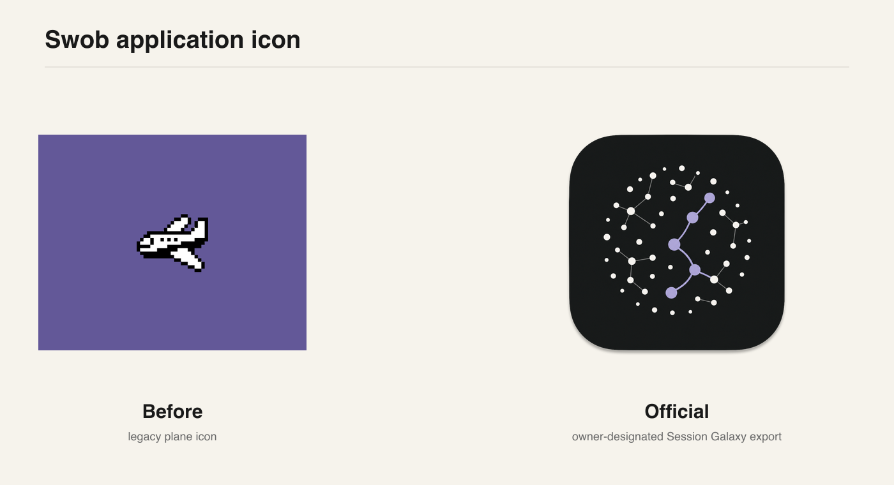
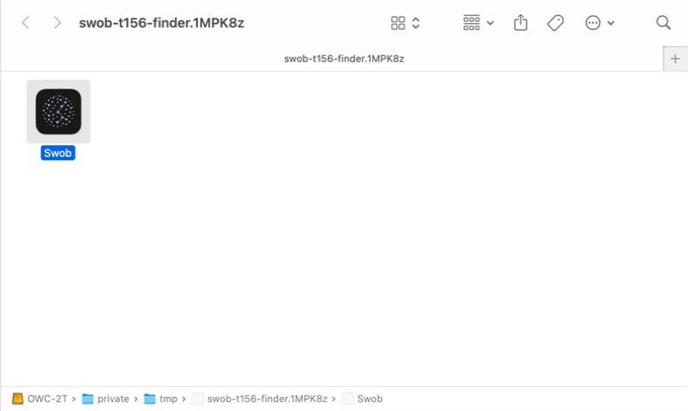
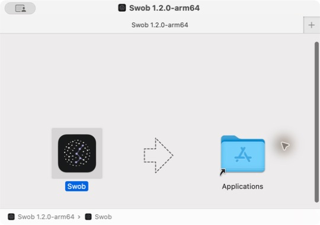
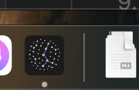
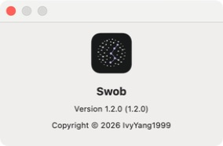
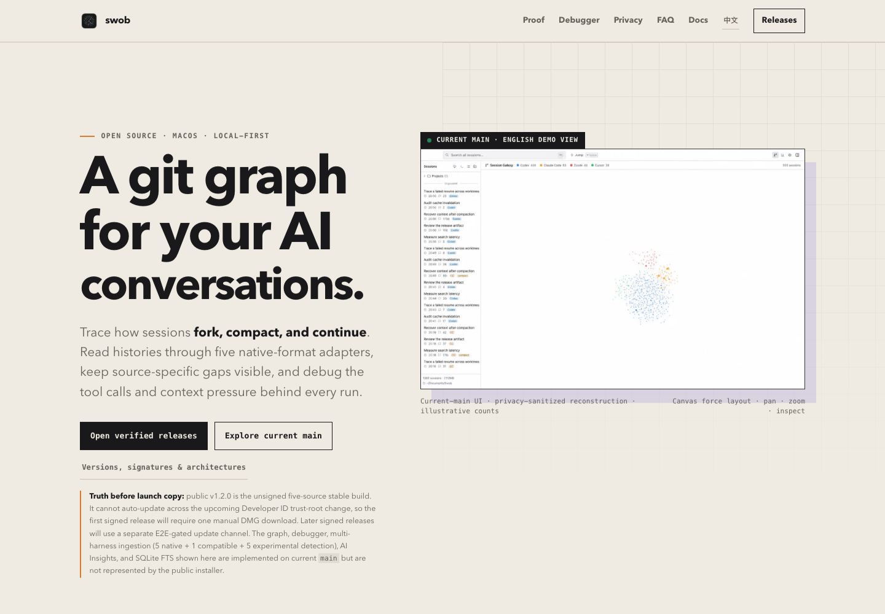

# t156 · Logo replacement and application icon pipeline

Date: 2026-07-23

Branch: `chore/t156-logo-pipeline`

Result: **PASS — implementation and local acceptance complete; no release was published.**

## Outcome

Swob now derives every application and favicon asset from one checked-in brand
source:

`build/brand/swob-logo-session-galaxy.png`

The owner explicitly designated a privately stored formal export as final on
2026-07-23. The checked-in source and `build/icon.png` preserve those bytes
exactly:

`19b75ad0a6f5d85f054b045cacd0c112346b0823e31d992aece323c16fc33846`

The same 1024px file is present in the owner's formal macOS iconset and iOS app
icon set. It already contains its final Big Sur silhouette and optical margin,
so the pipeline does **not** rescale or redraw the master. It only derives the
smaller platform assets.

### Correction record

The first t156 implementation incorrectly treated the vault's
`swob-app-icon-v3/icon.png` as authoritative. That inference was invalidated by
the owner's explicit correction. Git history and the earlier mailbox letter
remain unchanged as audit records; this report and the owner-designated formal
export supersede their source-selection claim.



## Reproducible pipeline

`scripts/generate-icons.mjs` generates and checks 11 outputs:

| Consumer | Outputs |
| --- | --- |
| Electron/macOS | `build/icon.png`, `build/icon.icns` |
| Electron/Windows | `build/icon.ico` |
| GitHub Pages/docs | `site/assets/favicon-32.png`, `apple-touch-icon.png`, `favicon-512.png`, `favicon.svg` |
| Future website app | matching files under `website/public/` |

Commands:

```sh
npm run icons:generate
npm run icons:check
```

The generation command writes only changed files. `--check` regenerates all
expected bytes in memory and fails when any checked-in derivative is missing or
stale. It also verifies the approved source hash and every output hash against
`build/brand/icon-manifest.json`, so replacing the formal master and
regenerating derivatives cannot silently pass. `npm run check` includes this
gate.

Container inspection:

- ICNS PNG chunks: 16, 32, 64, 128, 256, 512 and 1024 px.
- ICO PNG entries: 16, 24, 32, 48, 64, 128 and 256 px.
- `iconutil` successfully decoded the generated ICNS.
- Repository source and `build/icon.png` are byte-identical, 693,839-byte,
  1024×1024 RGBA PNGs.
- Master visible alpha bounds: x=93…930 and y=100…940, or 838×841 within the
  1024×1024 canvas. Edge margins are 93, 100, 93 and 83 px and pass the
  pipeline's 8–12% guard.
- A second generation produced the same aggregate SHA-256:
  `3745cfb2edff1a01733736133685145724f32792474397766b27bc64cb4ba282`.
- `site/assets/` and `website/public/` favicon hashes match at every size.

The SVG favicon is intentionally a deterministic raster-backed SVG wrapper:
there is no approved vector source, so auto-tracing would invent geometry and
weaken provenance. PNG sizes remain the authoritative raster derivatives.

## Packaged application acceptance

Command:

```sh
npm run build:mac:verify
```

The command produced an unsigned local verification build only:

- `dist/mac-arm64/Swob.app`
- `dist/swob-1.2.0-arm64.dmg`
- `dist/swob-1.2.0-arm64.zip`

`build/icon.icns`, the packaged app's
`Contents/Resources/icon.icns`, the copy inside the mounted DMG, and the DMG
`.VolumeIcon.icns` all had SHA-256:

`45ba87854907732f6256e37390a637a1bd3acd9ff5bd7e137f66e86a7f063a63`

### Finder



The repository lives under iCloud Documents, which dimmed the built app as
“Uploading” in Finder. This screenshot uses a local `ditto` staging copy; its
packaged ICNS hash is identical to `dist/mac-arm64/Swob.app`.

### Mounted DMG



### Dock



### About panel



All four native surfaces rendered the new icon. The lavender fork/resume line
remained recognizable in the About panel and Dock size; no white rim or opaque
square corner reappeared.

## Website acceptance



Playwright loaded the local site at 1440×1000 and confirmed:

- the brand image completed with a 512×512 intrinsic size;
- `link[rel=icon]` resolves to the newly generated SVG;
- page `scrollWidth` equals `clientWidth` (no horizontal regression).
- at 390×844, the 27×27 brand mark remained visible and the page still had no
  horizontal overflow; scrolling in both directions was also exercised.

## Compliance

`compliance/t131/asset-evidence-manifest.json` binds the canonical source and
all deterministic derivatives to a reviewed aggregate hash.
`asset-provenance.csv` records the canonical source as an original Swob project
brand asset, AI-assisted and finalized by owner-directed editing on 2026-07-22,
with no third-party material. `build/brand/README.md` records the source lineage
and regeneration contract. Adding `sharp` as a direct development dependency
also regenerated `THIRD_PARTY_NOTICES`.

## Gates

| Gate | Result |
| --- | --- |
| `npm run icons:check` | PASS · 11 current files |
| `npm run check` | PASS |
| `npm test` | PASS · 931 passed / 11 skipped |
| `npm run build:mac:verify` | PASS |
| macOS `iconutil` decode | PASS |
| Native Dock/Finder/About/DMG inspection | PASS |
| Playwright website inspection | PASS |

## Scope boundaries

- No product logic changed.
- No version bump, signing, notarization, upload or GitHub Release occurred.
- No `.bak` copy of the old icon was added; Git history remains the rollback
  mechanism.
